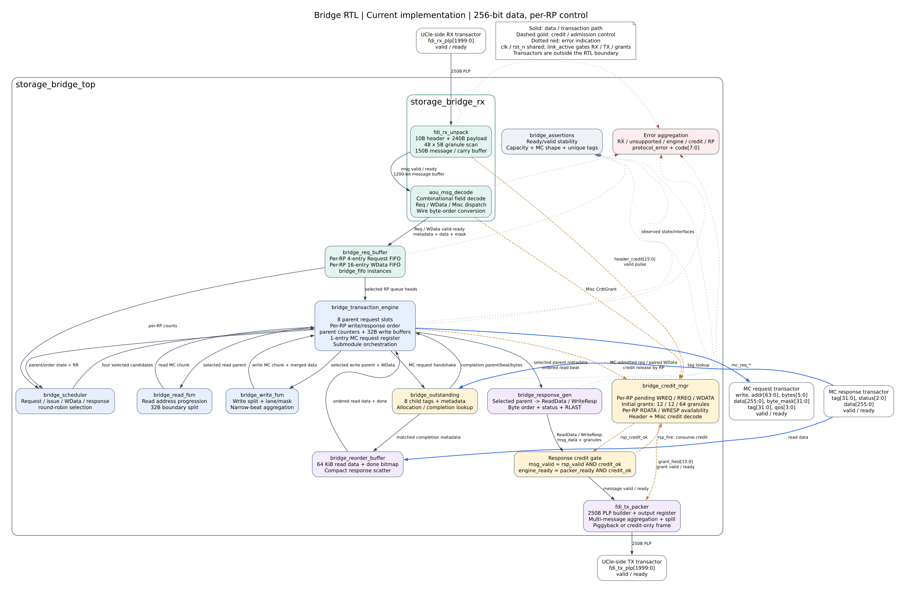
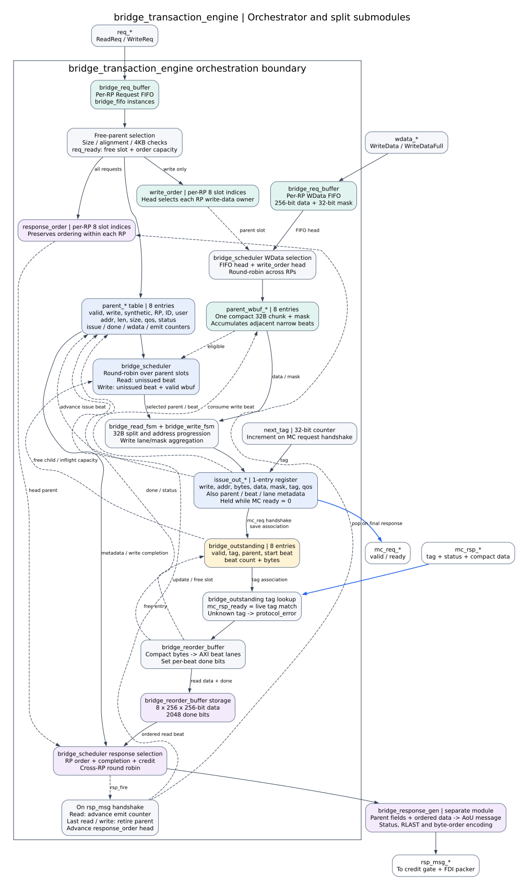

# 当前 Bridge RTL 内部结构

依据 2026-09-22 工作区内 `Bridge/rtl/*.sv` 绘制，描述现有实现。默认配置为
256-bit 数据、32-bit byte mask、8 项 parent、8 项 child、默认 RP_COUNT=1。
RTL 支持 RP_COUNT=1..4，当前定向回归覆盖 1 和 2。
图中的命名模块均为独立 RTL 实例；parent/order/issue 状态仍由事务编排层持有。

需要特别区分“模块名”和“状态归属”：当前 `bridge_read_fsm`、
`bridge_write_fsm` 是组合式的下一事务计算数据通路，并没有各自持有编码状态寄存器；
读写推进计数、parent 生命周期和顺序队列仍在 `bridge_transaction_engine` 中。

## 1. 顶层实际连接



[PNG](rtl_overview.png) | [SVG 矢量图](rtl_overview.svg) | [可编辑 DOT 图源](rtl_overview.dot)

实际实例层次如下；`bridge_pkg` 是常量和函数 package，不是硬件实例：

```text
storage_bridge_top
  rx: storage_bridge_rx
    unpack: fdi_rx_unpack
    decode: aou_msg_decode
  engine: bridge_transaction_engine
    req_buffer: bridge_req_buffer
      req_fifo[rp]: bridge_fifo
      wdata_fifo[rp]: bridge_fifo
    scheduler: bridge_scheduler
    read_fsm: bridge_read_fsm
    write_fsm: bridge_write_fsm
    outstanding: bridge_outstanding
    reorder: bridge_reorder_buffer
    response_gen: bridge_response_gen
    assertions: bridge_assertions
  credits: bridge_credit_mgr
  tx: fdi_tx_packer
```

FDI 两个方向各有一组 valid/ready，PLP 宽度均为 2000 bit。PLP 包括 10B 协议头和
240B 消息负载，负载分为 48 个 5B granule。这里没有链路物理帧 CRC、重放或 PHY。

`fdi_rx_unpack` 保存一个 PLP 的负载和 MsgStart 位图，逐 granule 扫描；150B
`message_buf` 保存当前消息，允许消息跨 PLP 延续。完整消息通过 1200-bit
`msg_data` 和有效长度送给组合译码器。遇到消息输出背压时扫描停住，FDI RX 也会背压。

`aou_msg_decode` 输出三个分支：请求描述符、写数据/掩码、Misc credit 消息。
同一个消息出口分时服务这些分支，并非三路消息可同时独立流动。

## 2. 事务引擎展开



[PNG](rtl_transaction_engine.png) | [SVG 矢量图](rtl_transaction_engine.svg) |
[可编辑 DOT 图源](rtl_transaction_engine.dot)

| 功能区 / 代码状态 | 默认容量 | 实际作用 |
|---|---:|---|
| `bridge_req_buffer.req_fifo` | 每 RP 4 项 | 吸收已获 credit 的请求，等待空闲 parent 槽 |
| `parent_*` | 8 项，读写共享 | 保存原请求、AoU ID/RP/user、地址、长度和各阶段进度 |
| `write_order` | 每 RP 8 个 parent 索引 | 指定该 RP 的下一拍写数据属于哪个写请求 |
| `response_order` | 每 RP 8 个 parent 索引 | 保持 RP 内父请求响应顺序 |
| `bridge_req_buffer.wdata_fifo` | 每 RP 16 项 | 独立接收数据，即使对应写请求尚未到达 |
| `parent_wbuf_*` | 每 parent 1 个 32B chunk | 聚合多个窄 WDATA beat，等待 MC 接受 |
| `bridge_scheduler` | 共享调度器 | 轮询选择具备发射条件的读或写 parent |
| `issue_out_*` | 1 项 | 注册 MC 请求和关联信息，背压时保持稳定 |
| `bridge_outstanding` | 8 项 | 保存 MC tag 到 parent、起始 beat、beat 数和 bytes 的映射 |
| `bridge_reorder_buffer.read_data` | 8 x 256 x 32B = 64 KiB | 保存完成的读数据，恢复原请求的 beat/lane 布局 |
| `bridge_reorder_buffer.read_done` | 2048 bit | 指示每个读 beat 是否已返回 |
| `bridge_response_gen` | 每 RP response_order 队首 | 编码调度器选中的已完成响应 |

64 KiB 是 RTL 数组声明的数据容量，不是综合后的 SRAM 面积结论。当前代码对该数组
有复位清零行为，能否映射为 RAM 需要后续综合检查。

### 主要状态归属

| 模块 | 持有的时序状态 |
|---|---|
| `fdi_rx_unpack` | 当前 PLP、granule 扫描位置和跨 PLP message carry |
| `bridge_req_buffer` / `bridge_fifo` | 每 RP Request/WData 队列、读写指针和计数 |
| `bridge_transaction_engine` | parent 表、write/response order、写 chunk、轮询指针和 MC issue 寄存器 |
| `bridge_outstanding` | child valid/tag/parent/offset/bytes 映射和在途计数 |
| `bridge_reorder_buffer` | 每 parent 的读数据和 beat done 位 |
| `bridge_credit_mgr` | 每 RP 接收容量、待归还 credit 和响应可用 credit |
| `fdi_tx_packer` | PLP builder、spill 和已注册 TX PLP |
| `bridge_scheduler` / 读写 FSM / `bridge_response_gen` | 无独立事务状态，按当前表项组合选择或编码 |

### 请求与写数据

请求握手后先进入对应 RP 的 4 项 Request FIFO；轮询分配器在 parent 有空位时将队首
请求移入 parent。所有已分配请求进入 `response_order`，写请求同时进入
`write_order`。分配时检查 size、自然对齐和 4KB 边界，非法请求设置 synthetic 状态。

写数据先进入对应 RP 的 `wdata_fifo`，随后与该 RP 的 `write_order` 队首配对。
相邻窄 beat 会逐字节累积到 `parent_wbuf` 的 32B chunk；chunk 完整或到达请求末尾后
才允许发射。最后一拍完成配对时弹出写顺序队列，父请求槽保留到响应交付 packer。

### MC 发射与返回

调度器对 parent 槽轮询。读请求有未发 beat 即可候选；写请求还要求 `wbuf_valid`。
存在空 child 槽且 MC 请求寄存器空闲时，将候选请求装入 `issue_out`。

```text
beat_bytes = 1 << parent_size
beat_addr  = parent_addr + parent_issue_beat * beat_bytes
chunk_bytes = min(剩余字节, 32 - beat_addr % 32)
chunk_beats = chunk_bytes / beat_bytes
```

合法自然对齐请求按 32B 边界生成 1..32B 紧凑 MC transaction。多个相邻窄 beat 会
聚合，边界首尾残片单独发射；非对齐原请求走错误路径。

MC 请求握手时登记 child 映射、增加 tag、推进发射 beat，并消费对应写缓冲。
`issue_out` 的装载条件使用旧的 valid，因此当前不能每拍持续发出一笔 MC 请求，
即使下游一直 ready，通常也有装载和交付交替的气泡。

响应按 `mc_rsp_tag` 查找 child；匹配项给出 parent、起始 beat、beat 数和 bytes。
读数据按地址散回一个或多个 AXI beat，设置对应 done 位；读写均推进完成计数并释放
child。这个结构允许子事务乱序返回。响应保持 RP 内顺序；不同 RP 之间轮询选择，某个
RP 缺少响应 credit 时不会阻塞其他 RP。

读请求的下一拍完成后即可生成该拍 ReadData，不要求整个读 burst 全部完成；正常写请求
等待所有 beat 发射并完成后生成一条 WriteResp。synthetic 错误有单独的响应选择路径，
不能把正常写完成条件视为该错误路径的完整验证结论。

## 3. Credit 与响应交付

| 事件 | 当前 RTL 行为 |
|---|---|
| 复位后链路激活 | 待发送初始 credit：WREQ 12、RREQ 12、WDATA 64 granules |
| 首笔 `mc_req_valid && mc_req_ready` | 归还对应 WriteReq/ReadReq credit |
| WDATA 从 ingress FIFO 配对并写入 parent chunk | 归还对应 WriteData credit |
| RX header / Misc CrdtGrant | 增加可发送 ReadData / WriteResp 的 credit |
| 响应具备足够 credit 且 packer ready | 响应被 packer 接受，同时扣除发送 credit |
| 最后一拍 ReadData / WriteResp 被 packer 接受 | 释放 parent 并弹出 response_order |
| `fdi_tx_valid && fdi_tx_ready` | 已注册的完整 PLP 交给上游 transactor |

parent 退休点在完整响应消息被 packer 接受时；packer 随后负责把消息可靠地放入输出
PLP，并在外部背压下保持稳定。`fdi_tx_packer` 可把连续消息聚合到同一个 48-granule
PLP，也支持跨 PLP spill/continuation，同时捎带 credit 或发送 credit-only PLP。
credit 计数、待归还计数和响应可用量均按 RP 独立维护。

## 4. 顶层端口

| 接口 | 输入到 Bridge | Bridge 输出 |
|---|---|---|
| 共用控制 | `clk`, `rst_n`, `link_active` | 无 |
| FDI RX | `fdi_rx_valid`, `fdi_rx_plp[1999:0]` | `fdi_rx_ready` |
| FDI TX | `fdi_tx_ready` | `fdi_tx_valid`, `fdi_tx_plp[1999:0]` |
| MC request | `mc_req_ready` | `valid`, `write`, `addr[63:0]`, `bytes[5:0]`, `data[255:0]`, `byte_mask[31:0]`, `tag[31:0]`, `qos[3:0]`，均带 `mc_req_` 前缀 |
| MC response | `valid`, `tag[31:0]`, `status[2:0]`, `data[255:0]`，均带 `mc_rsp_` 前缀 | `mc_rsp_ready` |
| 诊断 | 无 | `protocol_error`, `protocol_error_code[7:0]`, `busy`, `debug_*` |

当前下游只有一组 MC req/rsp。RTL 不输出 channel/bank/row/column，也没有图示中的
多控制器分发交叉开关；窗口地址处理和 DRAM 坐标映射在仿真适配层与 mem_sim 中完成。
尽管下游端口不是 AXI，AoU 请求仍保留原 AXI size/len 与数据 lane 语义，因此当前
lane/mask 的压紧和恢复逻辑仍然存在。

`busy` 合并事务引擎与 TX packer 状态，覆盖 parent/child、待发请求、WData FIFO、
TX builder/spill/输出寄存器；RX carry 和待归还 credit 仍需结合接口状态判断。

## 5. 与最初电路图的对应

| 最初图中的块 | 当前代码落点 |
|---|---|
| Flit Unpacket | `fdi_rx_unpack` + `aou_msg_decode` |
| Buffer | `bridge_req_buffer` + parent 表/parent_wbuf + `bridge_reorder_buffer` |
| Scheduler | 独立的 `bridge_scheduler` |
| W_FSM / R_FSM | 独立的 `bridge_write_fsm` / `bridge_read_fsm` |
| Reorder Buffer | `bridge_outstanding` tag 映射 + `bridge_reorder_buffer` 数据/done |
| response generator | 独立的 `bridge_response_gen` |
| credit | `bridge_credit_mgr` |
| Flit packet | `fdi_tx_packer` |
| Assertions | 独立的 `bridge_assertions`，观察 MC、response、容量和 tag |
| 多组 row/col/bank 端口及分发 MUX | 当前未实现，现阶段是单组字节地址 MC req/rsp |

## 6. 图源与代码索引

- [顶层](../rtl/storage_bridge_top.sv)
- [RX 组合层](../rtl/storage_bridge_rx.sv)
- [解包与 carry](../rtl/fdi_rx_unpack.sv)
- [消息译码](../rtl/aou_msg_decode.sv)
- [事务引擎](../rtl/bridge_transaction_engine.sv)
- [入口缓冲](../rtl/bridge_req_buffer.sv)
- [调度器](../rtl/bridge_scheduler.sv)
- [写 FSM](../rtl/bridge_write_fsm.sv)
- [读 FSM](../rtl/bridge_read_fsm.sv)
- [Outstanding](../rtl/bridge_outstanding.sv)
- [Reorder buffer](../rtl/bridge_reorder_buffer.sv)
- [响应生成](../rtl/bridge_response_gen.sv)
- [断言](../rtl/bridge_assertions.sv)
- [Credit](../rtl/bridge_credit_mgr.sv)
- [TX packer](../rtl/fdi_tx_packer.sv)
- [常量与格式](../rtl/bridge_pkg.sv)

从仓库根目录重新生成图：

```bash
dot -Tsvg Bridge/doc/rtl_overview.dot -o Bridge/doc/rtl_overview.svg
dot -Tpng -Gdpi=120 Bridge/doc/rtl_overview.dot -o Bridge/doc/rtl_overview.png
dot -Tsvg Bridge/doc/rtl_transaction_engine.dot -o Bridge/doc/rtl_transaction_engine.svg
dot -Tpng -Gdpi=120 Bridge/doc/rtl_transaction_engine.dot -o Bridge/doc/rtl_transaction_engine.png
```
