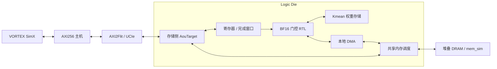

# Logic Die 架构与接口

## 放置与数据路径

VORTEX 的 Processor 执行 RV32IMF 程序。固定版本补丁把末级缓存后的真实 MemReq
交给外部接口，背压时保留请求，只有原链路的响应返回后才释放读请求。
16 项主机队列、32 项 VORTEX 外部在途表和 AXI 五通道携带实际数据。
当前 AXI 主机一次发送一条 64 B 缓存行，拆成两个 256 bit beat；10 bit ID 回卷后重用。

一个 SystemC 内核以 1 fs 分辨率推进全部组件：VORTEX/AXI 时钟为 2 ns，Logic Die
时钟为 4 ns。mem_sim 按其原生 250000 fs tick 推进；它没有自己的线程或第二套 SystemC。
HBM4 行为预设为 8 个 channel，32 B 事务；原生 timing 表包含 23 个 provisional 条目。
这属于体系结构研究模型，不能当作具体器件的引脚或协议认证结果。

## 门控运算

- 默认 32 个块、每头 128 维、4 个权重存储 bank；每个 bank 为 1024 × 16 bit。
- K 是连续的 `[chunk][token][dimension]` BF16 数组。块大小为 2 的幂，范围 1–4096。
- PREPARE：按 token 顺序用 FP32 累加，除以块大小，RNE 舍入到 BF16，存入本地 Kmean。
- QUERY：只读 256 B 的 Q；按维度做 BF16 乘法、FP32 累加，4 个块并行。
- 只对当前块之前的块打分并参与排序。当前块必选，额外选 min(K−1, current) 个历史块。
  当前块内的 token 级因果注意力由后续注意力内核处理。
- Top-K 使用浮点保序映射及逐位竞争；每个胜者扫描 32 bit。同分选择较小块号，
  +0 与 −0 视为同分。索引 0 放当前块，其余按分数降序。
- 非有限 K/Q、池化或打分的非有限中间结果返回错误。BF16 子正规数保留；
  FP32 舍入使用 Berkeley HardFloat，未实现张量量化标定或模型精度评测。

Kmean 占 8 KiB；pool 缓冲为 512 B，Q 缓冲为 256 B，32 个 score 占 128 B。
`ld_weight_bank` 明确描述同步读、同步写的数字存储接口。默认 DC 将其映射成标准单元
寄存器，因此综合面积包含这 8 KiB 的寄存器存储开销。尚未绑定物理 SRAM-CIM 宏；
未把文献中的 SRAM 宏面积、功耗或吞吐率算进本项目的测量。

## 驻留与完成

epoch、K 基址、块数和块大小组成驻留匹配条件。QUERY 必须与成功 PREPARE 的条件一致；
修改任何一项都会使旧驻留不可用。PREPARE 期间、DMA 故障后，resident 无效。
复用同一 KV 头的多个 Q 头不重新读取 K。软件修改 K 后必须换 epoch 并重新 PREPARE；
本接口没有缓存侦听一致性，K/Q 必须先对存储可见。

普通状态寄存器随时可读；完成窗口在 busy 时保持读响应，完成后返回状态、掩码与计数。
等待占据一个响应槽，但本地 DMA 从独立端口取得内存仲裁，因此不会阻止任务完成。
普通 VORTEX 请求和本地 DMA 在每个原生 tick 轮询仲裁。最大 4 个 host burst，DMA
一次一条 32 B 请求；结果和响应在背压期间保持。

## 物理地址

| 地址 | 用途 |
|---|---|
| 0x80000000–0x83ffffff | 在线 DRAM 窗口，容量 64 MiB |
| 0x0000f000–0x0000f3ff | Logic Die 寄存器，处于 VORTEX 的不可缓存 I/O 区 |
| 0x0000f400–0x0000f7ff | 仿真验收邮箱，仅用于加载参数和观察内核结果 |

寄存器偏移（32 bit，小端，写入要求全字节使能）：

| 偏移 | 读 / 写含义 |
|---|---|
| 0x00 | 读状态：bit0 busy、bit1 done、bit2 error、bit3 resident；写命令 1/2/3 = PREPARE/QUERY/两者 |
| 0x04 / 0x08 | K / Q 物理基址，32 B 对齐 |
| 0x0c / 0x10 | 块数 / 块大小 log2 |
| 0x14 / 0x18 / 0x1c | K / 当前块号 / epoch |
| 0x20 | 成功驻留的 epoch |
| 0x24 / 0x28 / 0x2c / 0x30 | 总周期 / 池化周期 / Q 与打分周期 / Top-K 周期 |
| 0x34 | 当前命令的 DMA beat 数 |
| 0x40 / 0x44 | 输出掩码 / 输出索引数 |
| 0x80 + 4i | 第 i 个选中块号 |
| 0x300 / 0x304 / 0x308 / 0x30c / 0x310 | 阻塞完成窗口：状态 / 掩码 / 个数 / 周期 / DMA beat 数 |

busy 期间写寄存器、非法命令/尺寸、失配 epoch、部分字节写返回 SLVERR，不更新寄存器。
DMA 越界或存储错误结束当前任务并报告 error。完成后可再次 PREPARE/QUERY；系统复位
时需要同时复位、排空整条链路，当前仅验证冷复位。
